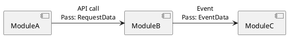
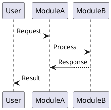
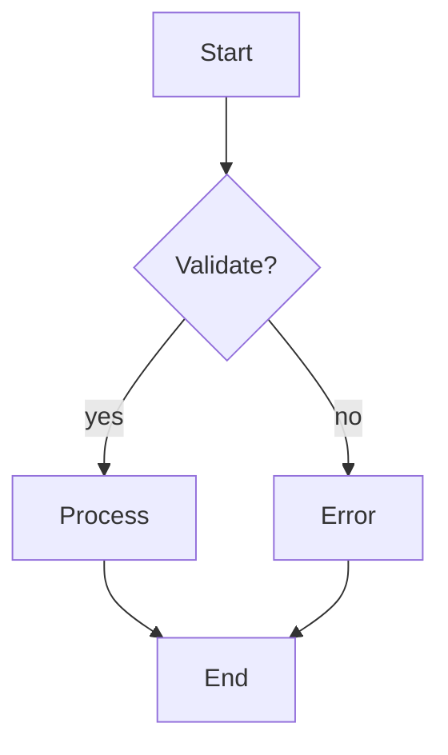
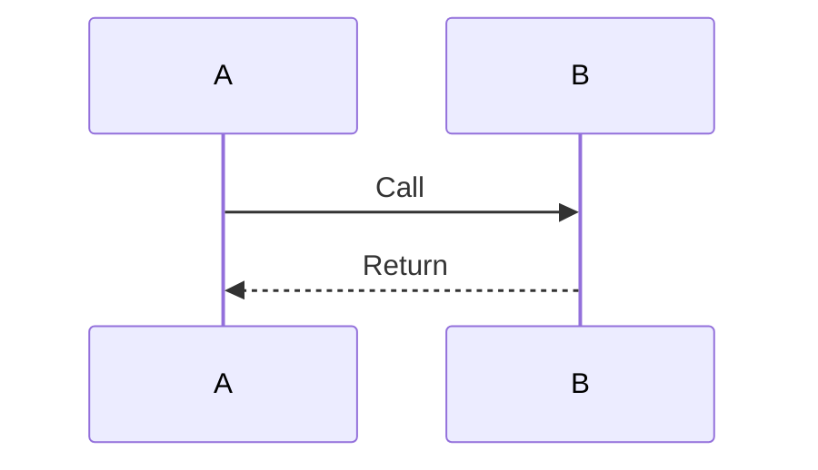
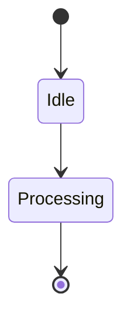

# Visualization Guide (PlantUML + Mermaid)

> **Reference file for SDD-Workflow** - Dual engine visualization strategy.

## Dual Engine Strategy

| Layer | Visualization Content | Tool | Reason |
|-------|----------------------|------|--------|
| **Architecture Layer** | Module dependencies, interaction sequences | **PlantUML** | Supports complex package structures, activation bars, color definitions |
| **Module Internal Layer** | Module interaction sequences | **PlantUML** | Consistent with architecture layer, supports complex sequences |
| **Module Internal Layer** | Function flow, state transitions | **Mermaid** | Markdown native, simple syntax for non-interaction diagrams |

---

## PlantUML Usage

### Use Cases

| Diagram Type | Purpose | Section |
|--------------|---------|---------|
| Component Diagram | Module dependency relationships | Part 2.1: Data Flow Diagram |
| Sequence Diagram | Module interaction sequences (both architecture and module internal) | Part 2.2, Part 3.4.4 |

### Component Diagram (Minimal Example)

### Sequence Diagram (Minimal Example)

---

## Mermaid Usage

### Use Cases

| Diagram Type | Purpose | Section |
|--------------|---------|---------|
| Flowchart | Function implementation flow (non-interaction) | Part 3.4.4: Implementation Logic |
| State Diagram | State transitions (non-interaction) | Part 3.4.1: Private Data & State |

**Note**: Mermaid does NOT use Sequence Diagram for interactions. Use PlantUML for all interaction diagrams.

### Flowchart (Minimal Example)

### Sequence Diagram (Minimal Example)

### State Diagram (Minimal Example)

---

## When to Use Flowcharts

**Use flowcharts ONLY for:**
- Non-obvious decision points
- Process loops where you might stop too early
- "When to use A vs B" decisions

**Never use flowcharts for:**
- Reference material → Tables, lists
- Code examples → Markdown blocks
- Linear instructions → Numbered lists
- Labels without semantic meaning (step1, helper2)

---

## Quick Reference

| Need | Use |
|------|-----|
| Module architecture | PlantUML Component Diagram |
| Module interaction (architecture layer) | PlantUML Sequence Diagram |
| Module interaction (internal layer) | PlantUML Sequence Diagram |
| Function flow (non-interaction) | Mermaid Flowchart |
| State machine (non-interaction) | Mermaid State Diagram |
| Reference data | Markdown Table |
| Linear steps | Numbered List |