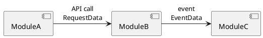
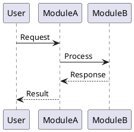
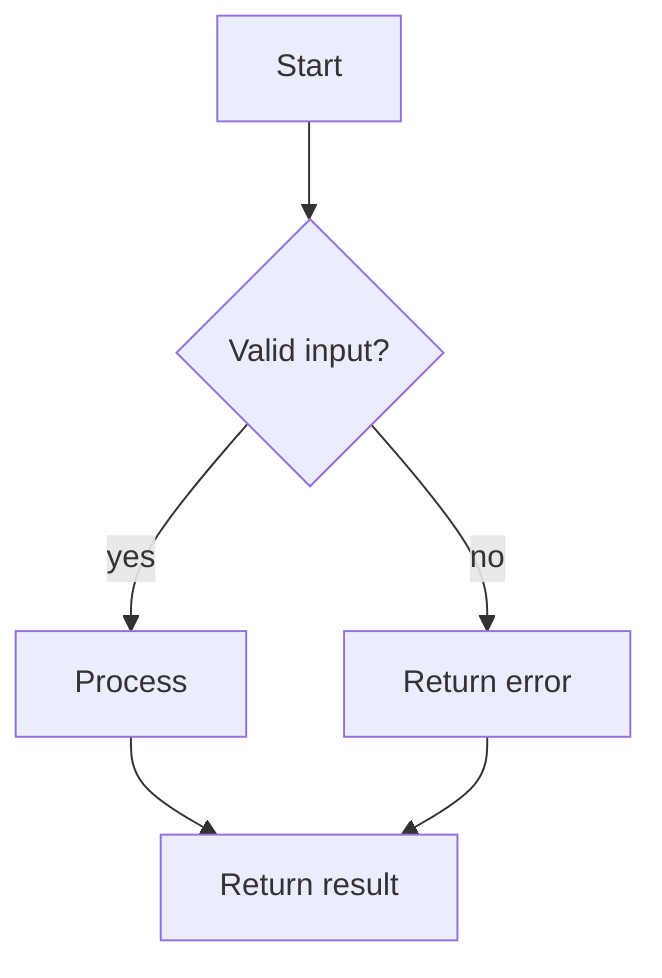
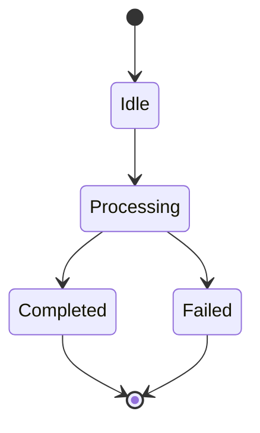

# Visualization Guide

Use PlantUML for interactions and Mermaid for non-interaction flow or state diagrams.

## Tool Choice

| Need | Tool | Section |
|------|------|---------|
| Module dependency view | PlantUML component diagram | Design Part 2.1 |
| Cross-module interaction sequence | PlantUML sequence diagram | Design Part 2.2 |
| Internal module interaction sequence | PlantUML sequence diagram | Design Part 3.4.4 |
| Function flow or decision tree | Mermaid flowchart | Design Part 3.4.4 |
| State transitions | Mermaid state diagram | Design Part 3.4.1 |
| Reference data | Markdown table | Any section |

Do not use Mermaid sequence diagrams for interaction diagrams in this workflow.

## PlantUML Component Example

```plantuml
@startuml
[ModuleA] -> [ModuleB] : API call\nRequestData
[ModuleB] -> [ModuleC] : event\nEventData
@enduml
```

## PlantUML Sequence Example

```plantuml
@startuml
User -> ModuleA : Request
ModuleA -> ModuleB : Process
ModuleB --> ModuleA : Response
ModuleA --> User : Result
@enduml
```

## Mermaid Flowchart Example

```mermaid
flowchart TD
    A[Start] --> B{Valid input?}
    B -->|yes| C[Process]
    B -->|no| D[Return error]
    C --> E[Return result]
    D --> E
```

## Mermaid State Example

```mermaid
stateDiagram-v2
    [*] --> Idle
    Idle --> Processing
    Processing --> Completed
    Processing --> Failed
    Completed --> [*]
    Failed --> [*]
```

## Diagram Rules

- Use diagrams only when they clarify a non-obvious boundary, interaction, branch, or state transition.
- Keep labels semantic, not generic step names.
- Use tables for reference data.
- Use numbered lists for linear steps.
- Keep code examples in Markdown code blocks, not diagrams.
